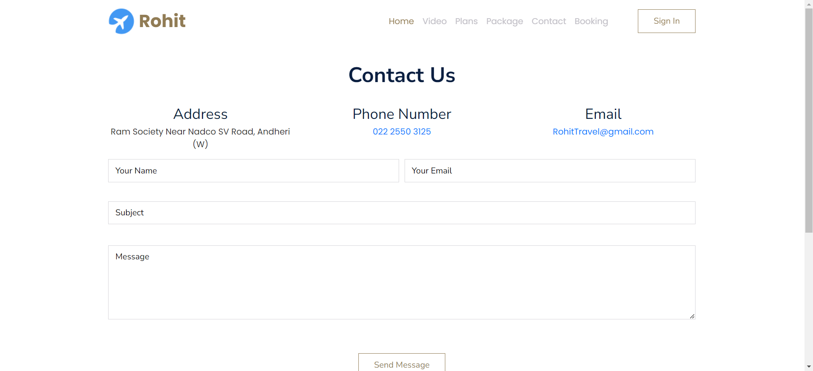
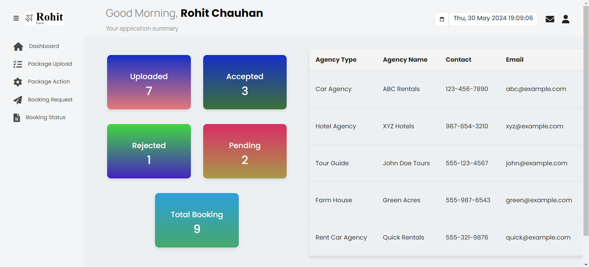
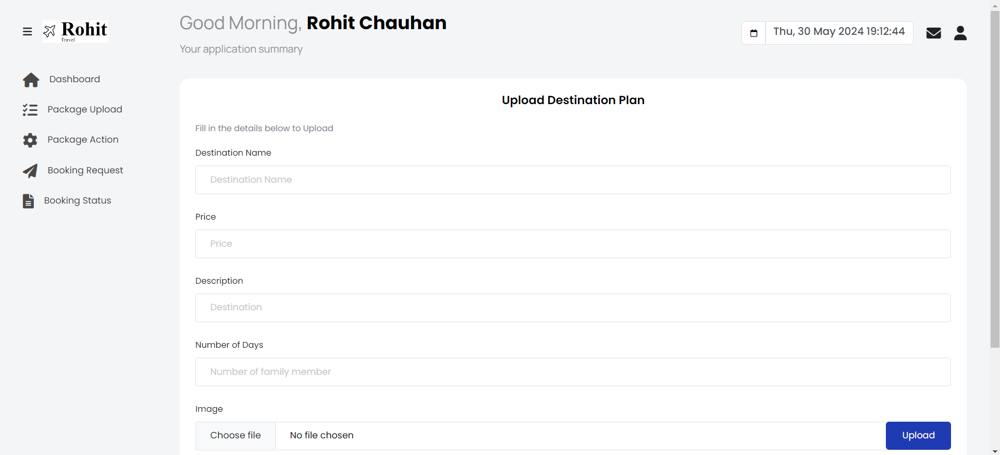
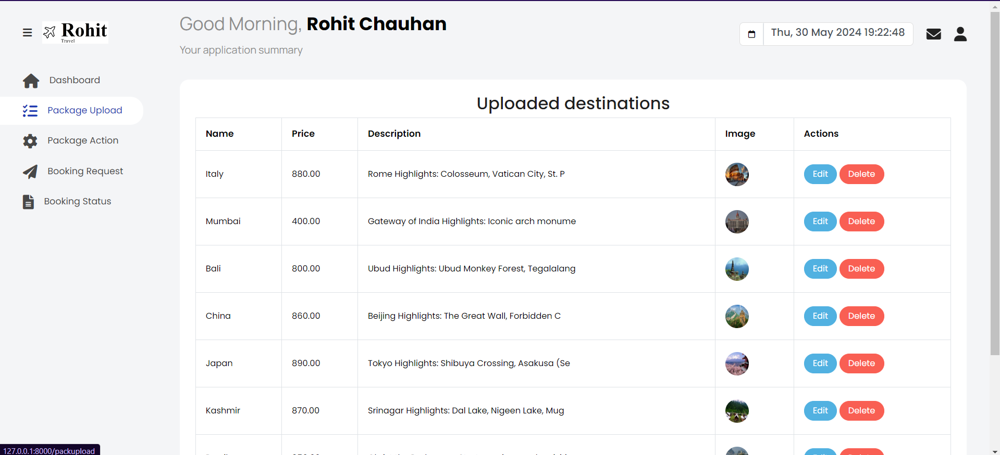
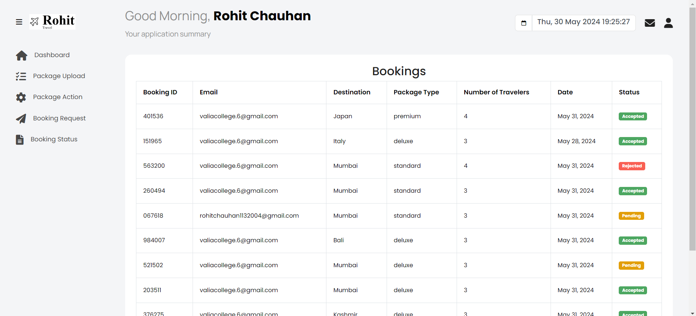

The Copyright are Reserved By Rohit Chawhan

# The Connection With MongoDB.

# The Connection With Mysql (Xaamp).

The Travel website
# Home Page
In Home Page Sign in option show until user login that. Without login the user cannot books the plans.

# Plans page 
The plan can be managed by admin where admin can add edit and delete plan

# Booking Page 
We create booking page, where without login user cannot book the plans. when user booking the package we take user email as a session and store in database with booking ID. The booking status send user through email.

# Contact Page
If user has any query then they can use contact service when user sent message the admin will receive mail

# Admin Dashboard page
The dashboard page will show pending request, accept request, reject, total plans and total booking request

# Plans upload page 
Plans page helps the admin to uploads the plans.

# Edit plans page
It helps the admin to edit or delete the uploaded plans

# 
